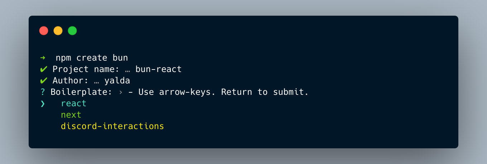

# Create Bun Boilerplates

[](https://www.npmjs.com/package/create-bun)
[](https://www.npmjs.com/package/create-bun)
[](https://github.com/guocaoyi/create-bun/actions/workflows/npm-publish.yml)

> Scaffolding your bun project boilerplate

## Installing

> Bun >= 0.1 and Node >= 14.18.0

[Bun](https://bun.sh/) is a fast all-in-one JavaScript runtime

```bash
# use npm-create command, or use pnpm | yarn
λ npm create bun

# or use npx command
λ npx create-bun

# or use npm-init command
λ npm init create-bun
```

## Preview


